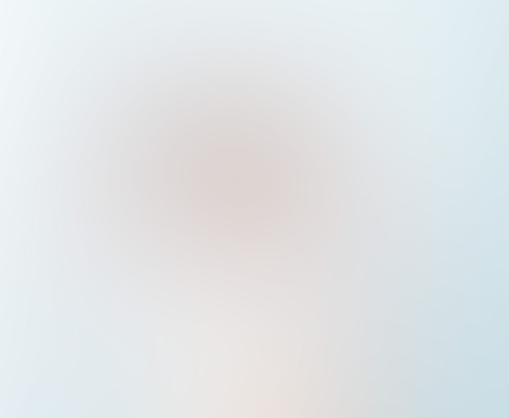
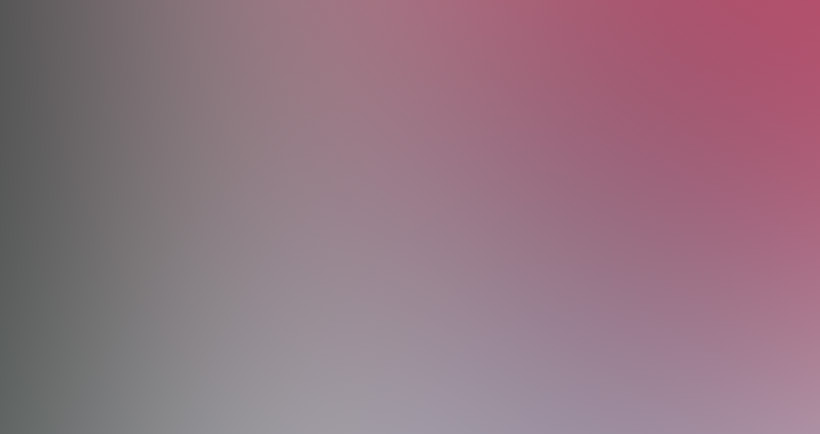
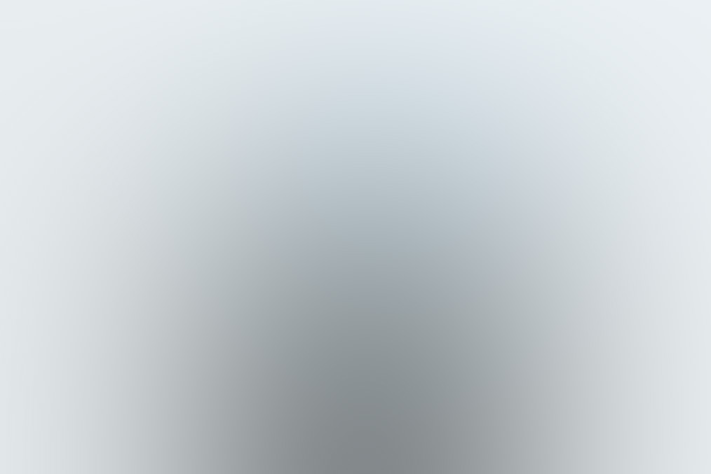
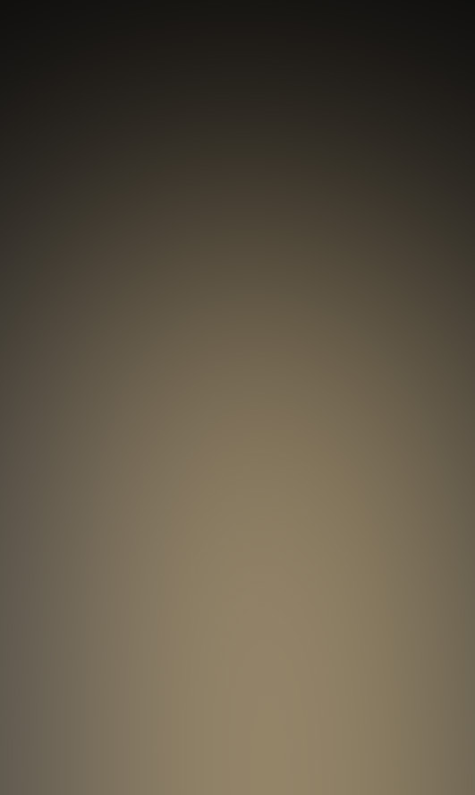

# ESPECIFICACIÓN WEB — AillenWebPage (Reconstrucción en React)

> **Propósito**: documento único y auto-suficiente para crear desde cero una app React que replique
> exactamente el diseño, la estructura, los estilos y las proporciones de la web actual
> (plantilla *Paradigm Shift* de HTML5 UP, ubicada en `index.html` + `assets/css/main.css`),
> con estos cambios acordados:
>
> 1. **Paleta**: el acento `#49fcd4` (teal) pasa a `#df3c01` (naranja quemado), con familia derivada.
> 2. **Navbar**: nueva barra de navegación minimalista flotante con sombra.
> 3. **2 paneles flotantes**: dos divs blancos de altura completa, equiespaciados, con video de TikTok (embed oficial) + texto.
> 4. **Chatbot**: botón grande fijo abajo que abre un panel de chat (solo diseño).
> 5. **Animaciones**: todo lo animado se implementa con **GSAP** (+ ScrollTrigger).
>
> Este archivo es la única fuente de verdad. Cualquier valor no especificado aquí se toma del
> CSS original (`assets/css/main.css`).

---

## Tabla de contenidos

1. [Resumen del diseño original](#1-resumen-del-diseño-original)
2. [Design tokens](#2-design-tokens)
3. [Layout base — sistema de 2 columnas](#3-layout-base--sistema-de-2-columnas)
4. [Estructura de la página (DOM sección por sección)](#4-estructura-de-la-página-dom-sección-por-sección)
5. [Especificación de componentes (CSS exacto)](#5-especificación-de-componentes-css-exacto)
6. [Elementos nuevos — Navbar, Paneles de video, Chatbot](#6-elementos-nuevos--navbar-paneles-de-video-chatbot)
7. [Animaciones con GSAP](#7-animaciones-con-gsap)
8. [Responsive — breakpoints](#8-responsive--breakpoints)
9. [Arquitectura React propuesta](#9-arquitectura-react-propuesta)
10. [Assets](#10-assets)
11. [Desviaciones intencionales respecto al original](#11-desviaciones-intencionales-respecto-al-original)
12. [Checklist de fidelidad](#12-checklist-de-fidelidad)

---

## 1. Resumen del diseño original

- **Base**: página de una sola vista, scroll vertical largo. Fondo blanco `#ffffff`, texto negro `#000000`.
- **Concepto visual**: la pantalla se divide en **dos mitades verticales de 50vw**:
  - **Columna izquierda**: títulos de sección (alineados a la derecha) sobre un fondo de color acento
    con patrón geométrico SVG + una **línea de tiempo vertical** con guiones y puntos junto a cada título.
  - **Columna derecha**: contenido (texto, imágenes, galerías, formularios).
- **Estética**: minimalista, mucha tipografía, mayúsculas con tracking amplio (`0.175em`),
  bordes sutiles `rgba(144,144,144,0.25)`, radios pequeños (`0.325rem`), sin bordes gruesos ni gradientes.
- **Iconografía**: Font Awesome 5 (Free + Brands).
- **Interacciones originales**: animación de entrada (preload), smooth scroll con offset 100,
  lightbox de galería con spinner/lock/ESC.

### Secciones del documento (en orden)

| # | Sección | Contenido | ID para navbar |
|---|---------|-----------|----------------|
| 0 | `intro` | h1 + subtítulo + flecha + imagen full-screen | `#intro` |
| 1 | `first` | Párrafo + imagen ancha | `#first` |
| 2 | features | Párrafo + lista de 6 feature-icons + párrafo | `#features` |
| — | **PANEL VIDEO 1** *(nuevo)* | TikTok izquierda + texto derecha | — |
| 3 | galería | 3 sub-secciones con galerías (4 / 3 / 3 imágenes) | `#galeria` |
| — | **PANEL VIDEO 2** *(nuevo)* | TikTok izquierda + texto derecha | — |
| 4 | CTA | Párrafo + 2 botones (`primary large` + `large`) | — |
| 5 | contacto | Formulario + footer con datos + iconos sociales | `#contacto` |
| — | copyright | Línea de copyright | — |
| — | **NAVBAR** *(nuevo, fixed)* | Navegación a secciones | — |
| — | **CHATBOT** *(nuevo, fixed)* | Botón abajo + panel de chat | — |

---

## 2. Design tokens

### 2.1 Paleta de color

#### Colores fijos (no cambian)

| Token | Valor | Uso |
|-------|-------|-----|
| `--bg` | `#ffffff` | Fondo de página y de paneles flotantes |
| `--fg` | `#000000` | Texto, headings, botones ghost |
| `--border` | `rgba(144, 144, 144, 0.25)` | Bordes de inputs, botones ghost, hr, tablas, blockquote |
| `--border-soft` | `rgba(144, 144, 144, 0.1)` | Fondo de code, hover de iconos, hexágonos de feature-icons |
| `--placeholder` | `rgba(0, 0, 0, 0.25)` | Placeholder de inputs, texto de copyright |
| `--overlay` | `rgba(255, 255, 255, 0.875)` | Fondo del lightbox de galería |

#### Acento — mapeo teal → naranja

| Rol | Original (teal) | **Nuevo (naranja)** | Uso |
|-----|-----------------|---------------------|-----|
| Acento base | `#49fcd4` | **`#df3c01`** | Fondo botón primary, checkbox/radio checked, fondo columna izquierda |
| Acento hover (más claro) | `#93ffe7` | **`#ef6a3c`** | Hover de botón primary |
| Acento active (más oscuro) | `#44f2cb` | **`#c23501`** | Active de botón primary |
| Outline/focus | `#2ee4bb` | **`#e2551f`** | Hover/active de botón ghost (box-shadow + color), focus de inputs |
| Línea de tiempo / marcadores | `#43d9b8` | **`#c23501`** | Línea vertical, guiones, puntos, punto final |
| Relleno de active ghost | `rgba(73, 252, 212, 0.25)` | **`rgba(223, 60, 1, 0.25)`** | Fondo al presionar botón ghost |
| Patrón SVG (desktop) | `rgba(67, 217, 184, 0.25)` | **`rgba(194, 53, 1, 0.25)`** | Fill del path del patrón geométrico (`#wrapper:before`) |
| Patrón SVG (≤1152px) | `rgba(67, 217, 184, 0.5)` | **`rgba(194, 53, 1, 0.5)`** | Fill del path del patrón en headers de sección (columna única) |

**Variables CSS recomendadas** (definir en `:root` de la hoja global):

```css
:root {
  --bg: #ffffff;
  --fg: #000000;
  --accent: #df3c01;
  --accent-light: #ef6a3c;
  --accent-dark: #c23501;
  --accent-focus: #e2551f;
  --accent-ghost: rgba(223, 60, 1, 0.25);
  --pattern-fill: rgba(194, 53, 1, 0.25);
  --pattern-fill-strong: rgba(194, 53, 1, 0.5);
  --border: rgba(144, 144, 144, 0.25);
  --border-soft: rgba(144, 144, 144, 0.1);
  --placeholder: rgba(0, 0, 0, 0.25);
  --overlay: rgba(255, 255, 255, 0.875);
  --radius: 0.325rem;
  --font-body: "Source Sans Pro", Helvetica, sans-serif;
  --font-heading: "Raleway", Helvetica, sans-serif;
}
```

### 2.2 Tipografía

**Familias** (import de Google Fonts — mantener exacto):

```
https://fonts.googleapis.com/css?family=Source+Sans+Pro:300,600,700,300i,600i,700i|Raleway:600,800
```

- Cuerpo: `"Source Sans Pro"` pesos 300 (normal), 600 (`strong`), 700, + itálicas.
- Títulos y botones/labels: `"Raleway"` pesos 600 y 800.

**Tamaño raíz responsive** (`html { font-size }` — todo lo demás está en rem):

| Breakpoint | font-size |
|------------|-----------|
| default (>1920px) | `18pt` |
| ≤1920px | `13pt` |
| ≤1152px | `14pt` |
| ≤736px | `12pt` |
| ≤480px | `11pt` |

**Escala tipográfica:**

| Elemento | font-family | size | weight | letter-spacing | line-height | transform | margin |
|----------|-------------|------|--------|----------------|-------------|-----------|--------|
| `body` | Source Sans Pro | `1rem` | 300 | `0.0375em` | `2` | none | — |
| `h1` | **Source Sans Pro** | `5rem` | 700 | `-0.05em` | `1.1` | **none** | `0 0 1.5rem` |
| `h2` | Raleway | `1.25rem` | 800 | `0.175em` | `1.75` | uppercase | `0 0 2rem` |
| `h3` | Raleway | `0.875rem` | 600 | `0.175em` | `1.75` | uppercase | `0 0 1.5rem` |
| `h4` | Raleway | `0.875rem` | 600 | `0.175em` | `1.75` | uppercase | `0 0 1.5rem` |
| `h5` | Raleway | `0.75rem` | 600 | `0.175em` | `1.75` | uppercase | `0 0 1.5rem` |
| `h6` | Raleway | `0.625rem` | 600 | `0.175em` | `1.75` | uppercase | `0 0 1.5rem` |
| `p` | — | — | — | — | — | — | `0 0 2rem` |
| `strong/b` | — | — | 600 | — | — | — | — |
| `a` | — | — | — | — | — | — | border-bottom `dotted 1px`, color `#000`, transición `border-bottom-color 0.25s ease-in-out`, hover → borde transparente |

**Subtítulo del intro** (`h1 + p`): Raleway, `0.8rem`, `letter-spacing: 0.175em`, `line-height: 2.5`, uppercase.

**Ajustes responsive de headings:**

| Breakpoint | h1 | h2 | h3 | h4 | h5 |
|------------|----|----|----|----|----|
| ≤736px | `4.5rem` (lh 1.1) | `1.25rem` (lh 1.7) | `0.9rem` | `0.75rem` | `0.675rem` |
| ≤360px | `3.75rem` | `1.125rem` | `0.8rem` | `0.675rem` | `0.675rem` |

### 2.3 Radios, sombras y espaciado

- **Radio estándar**: `0.325rem` (botones, inputs, box, checkbox, paneles nuevos, chat).
- **Radio de puntos de timeline**: `0.5rem` (sobre elementos de `0.5rem` → círculo).
- **Sombras existentes**:
  - Lightbox imagen: `0 1rem 3rem 0 rgba(0, 0, 0, 0.35)`.
- **Sombras nuevas** (elementos agregados — ver sección 6):
  - Navbar: `0 0.5rem 2rem rgba(0, 0, 0, 0.12)`.
  - Paneles de video: `0 1.5rem 3.5rem rgba(0, 0, 0, 0.15)` (discreta).
  - Chat panel: `0 2rem 5rem rgba(0, 0, 0, 0.25)`.
  - Chat botón: `0 0.5rem 2rem rgba(223, 60, 1, 0.35)`.
- **Espaciado vertical entre secciones**: `7.5rem` (ver sección 8 para breakpoints).
- **Bordes estándar**: `solid 2px var(--border)` (inputs, botones vía box-shadow inset).
- `hr`: `border-bottom: solid 2px var(--border)`, margin `3rem 0` (`.major` → `5rem 0`, ≤736px → `3rem 0`).
- `blockquote`: `border-left: solid 0.5rem var(--border)`, itálica, `padding: 1rem 0 1rem 2rem`, margin `0 0 2rem`.
- `code`: bg `var(--border-soft)`, radius `0.325rem`, `"Courier New"` `0.9rem`, `padding: 0.25rem 0.65rem`.

---

## 3. Layout base — sistema de 2 columnas

### 3.1 Contenedor raíz

```
#wrapper {
  position: relative;
  width: 100vw;
  padding: 0 0 10rem 0;   /* ≤1280px → 8rem, ≤1152px → 0 */
  overflow-x: hidden;      /* también en html y body */
}
```

### 3.2 Fondo de la columna izquierda (patrón geométrico)

`#wrapper:before` dibuja el fondo acento + patrón que ocupa la mitad izquierda **detrás de todo**:

```css
#wrapper:before {
  background-attachment: fixed;
  background-color: var(--accent);            /* #df3c01 */
  background-image: url("<SVG patrón geométrico>");
  background-position: -50% 10%;
  background-repeat: repeat-y;
  background-size: 75% auto;
  content: '';
  display: block;
  height: 100%;
  left: 0;
  position: absolute;
  top: 0;
  width: 50vw;
  z-index: -1;
}
```

> **SVG del patrón**: es un `data:image/svg+xml` con un solo `<path>` geométrico (triangulitos
> diagonales estilizados, `viewBox="0 0 920 1750"`). **Copiar textualmente el data-URI de
> `assets/css/main.css`** (línea ~3227, el de `#wrapper:before`) y reemplazar únicamente el fill:
> `fill: rgba(67, 217, 184, 0.25)` → `fill: rgba(194, 53, 1, 0.25)`.
> El mismo SVG con `fill: rgba(194, 53, 1, 0.5)` se usa ≤1152px en el header de cada sección
> (data-URI de la línea ~3591 del CSS original).

**Móvil real** (`body.is-mobile` equivalente → en React, detectar touch/mobile y aplicar clase):
`background-attachment: scroll; background-position: 50% -3%; background-size: 150% auto;`

### 3.3 Grid de cada sección

Cada `<section>` del wrapper es un grid CSS:

```css
#wrapper section {
  display: grid;
  grid-template-areas: "header content"
                       "footer content";
  grid-template-columns: 50vw 50vw;
  grid-template-rows: 1fr;
  margin: 7.5rem 0 0 0;          /* separación entre secciones */
}
```

- **`section > header`** (columna izquierda): `grid-area: header; justify-self: end; text-align: right;`
  `padding: 0 10rem 0 5rem; width: 35rem;` — el h2 tiene `margin: 0 0 5rem 0`.
- **`section > .content`** (columna derecha): `grid-area: content; max-width: 60rem; position: relative;`
  `padding: 0 5rem;`
- **`section > footer`**: `grid-area: footer; text-align: right; padding: 0 10rem;`
  (solo la sección de contacto usa footer).
- `ul.actions` dentro de header/footer: `justify-content: flex-end`.

### 3.4 Línea de tiempo vertical (columna izquierda)

La línea vive en el eje `left: calc(50vw - 5rem)` (5rem antes del centro de la pantalla):

```css
/* Línea vertical */
#wrapper > section > header:before {
  background: var(--accent-dark);              /* #c23501 */
  content: '';
  display: block;
  margin-top: 1rem;
  position: absolute;
  width: 2px;
  height: calc(100% + 10rem);                  /* sobresale 10rem por debajo */
  left: calc(50vw - 5rem);
}

/* Guion horizontal junto a cada h2 */
#wrapper > section > header h2:before {
  background: var(--accent-dark);
  content: '';
  display: block;
  height: 2px;
  width: 2.5rem;
  position: absolute;
  top: 1rem;
  right: -5rem;                                /* nace en el eje de la línea */
}

/* Punto circular junto a cada h2 */
#wrapper > section > header h2:after {
  background: var(--accent-dark);
  border-radius: 0.5rem;
  content: '';
  display: block;
  height: 0.5rem;
  width: 0.5rem;
  position: absolute;
  top: 0.75rem;
  right: -2.5rem;                              /* centrado sobre el eje */
}
```

- Para `h1` (intro): guion en `top: 3rem` y punto en `top: 2.75rem` (el h1 tiene `margin-top: -2rem`).
- **Última sección** (contacto): la línea pasa a `height: 100%` y se agrega un **punto final** en
  `header:after`: `bottom: -1.5rem; left: calc(50vw - 5rem - 0.25rem + 1px); width/height: 0.5rem;
  border-radius: 0.5rem; background: var(--accent-dark); z-index: 1;`

### 3.5 Sección `intro` (excepciones)

```css
#wrapper > section.intro { align-items: center; }
#wrapper > section.intro > header {
  padding-top: 4rem;
  width: 100%;
}
#wrapper > section.intro > header > * {
  margin-left: auto;          /* empuja el bloque a la derecha */
  width: 20rem;               /* ≤1280px → 21rem, ≤1152px → 100% */
}
#wrapper > section.intro > header:before {
  left: auto;
  margin-left: calc(50vw - 10rem);   /* alinea la línea con el bloque */
}
#wrapper > section.intro > .content {
  height: 100vh;              /* imagen de portada ocupa pantalla completa */
  max-width: none;
}
```

### 3.6 Sub-secciones anidadas (galería)

Dentro de `.content` puede haber `<section>` anidadas (la galería usa 3). Cada una:

```css
#wrapper > section > .content > section {
  position: relative;
  left: calc(-50vw - 5rem);       /* se desplaza para ocupar ancho completo */
}
#wrapper > section > .content > section:first-child { margin-top: 6rem; }
#wrapper > section > .content > section > header { width: 32rem; }
```

(≤1280px: `left: calc(-50vw - 4rem)`, header `30rem`.)

### 3.7 Copyright

```css
#wrapper .copyright {
  color: var(--placeholder);       /* rgba(0,0,0,0.25) */
  font-size: 1rem;
  left: 50vw;
  position: relative;
  width: 50vw;
  padding: 0 5rem;
}
```

Texto: `© Untitled. All rights reserved. Design: HTML5 UP.` (mantener placeholder; en React
puede parametrizarse).

---

## 4. Estructura de la página (DOM sección por sección)

Árbol objetivo de la app (los comentarios indican contenido placeholder del original — mantener
para fidelidad de diseño hasta que haya contenido real):

```html
<div id="wrapper">
  <!-- NAVBAR (nuevo, fuera del flujo: fixed) -->

  <!-- 0. INTRO -->
  <section class="intro" id="intro">
    <header>
      <h1>Paradigm Shift</h1>
      <p>A free responsive site template designed by @ajlkn / HTML5 UP</p>
      <ul class="actions">
        <li><a href="#first" class="arrow scrolly"><span class="label">Next</span></a></li>
      </ul>
    </header>
    <div class="content">
      <span class="image fill" data-position="center"></span>
    </div>
  </section>

  <!-- 1. FIRST -->
  <section id="first">
    <header><h2>Magna sed nullam nisl adipiscing</h2></header>
    <div class="content">
      <p><strong>Lorem ipsum dolor</strong> … (párrafo largo del original)</p>
      <span class="image main"></span>
    </div>
  </section>

  <!-- 2. FEATURES -->
  <section id="features">
    <header><h2>Feugiat consequat tempus ultrices</h2></header>
    <div class="content">
      <p><strong>Etiam tristique libero</strong> …</p>
      <ul class="feature-icons">
        <li class="icon solid fa-laptop">Consequat tempus</li>
        <li class="icon solid fa-bolt">Etiam adipiscing</li>
        <li class="icon solid fa-signal">Libero nullam</li>
        <li class="icon solid fa-cog">Blandit condimentum</li>
        <li class="icon solid fa-map-marker-alt">Lorem ipsum dolor</li>
        <li class="icon solid fa-code">Nibh amet venenatis</li>
      </ul>
      <p>Vehicula ultrices sed ultricies …</p>
    </div>
  </section>

  <!-- PANEL DE VIDEO 1 (nuevo) -->

  <!-- 3. GALERÍA -->
  <section id="galeria">
    <header><h2>Ultrices erat magna sed condimentum</h2></header>
    <div class="content">
      <p><strong>Integer mollis egestas</strong> …</p>

      <section>  <!-- sub-sección 1: "Erat aliquam" -->
        <header><h3>Erat aliquam</h3><p>…</p></header>
        <div class="content">
          <div class="gallery">
            <a href="images/gallery/fulls/01.jpg" class="landscape"></a>
            <a href="images/gallery/fulls/02.jpg"></a>
            <a href="images/gallery/fulls/03.jpg"></a>
            <a href="images/gallery/fulls/04.jpg" class="landscape"></a>
          </div>
        </div>
      </section>

      <section>  <!-- sub-sección 2: "Nisl consequat" — 3 imágenes (05, 06, 07) -->
        …misma estructura…
      </section>

      <section>  <!-- sub-sección 3: "Lorem gravida" — 08 portrait, 09 portrait, 10 landscape -->
        …misma estructura…
      </section>
    </div>
  </section>

  <!-- PANEL DE VIDEO 2 (nuevo) -->

  <!-- 4. CTA -->
  <section>
    <header><h2>Duis sed adpiscing veroeros amet</h2></header>
    <div class="content">
      <p><strong>Proin tempus feugiat</strong> …</p>
      <ul class="actions">
        <li><a href="#" class="button primary large">Get Started</a></li>
        <li><a href="#" class="button large">Learn More</a></li>
      </ul>
    </div>
  </section>

  <!-- 5. CONTACTO -->
  <section id="contacto">
    <header><h2>Get in touch</h2></header>
    <div class="content">
      <p><strong>Auctor commodo</strong> …</p>
      <form>
        <div class="fields">
          <div class="field half"><input type="text" placeholder="Name" /></div>
          <div class="field half"><input type="email" placeholder="Email" /></div>
          <div class="field"><textarea rows="7" placeholder="Message"></textarea></div>
        </div>
        <ul class="actions">
          <li><input type="submit" value="Send Message" class="button primary" /></li>
        </ul>
      </form>
    </div>
    <footer>
      <ul class="items">
        <li><h3>Email</h3><a href="#">information@untitled.ext</a></li>
        <li><h3>Phone</h3><a href="#">(000) 000-0000</a></li>
        <li><h3>Address</h3><span>1234 Somewhere Road, Nashville, TN 00000</span></li>
        <li>
          <h3>Elsewhere</h3>
          <ul class="icons">
            <!-- twitter, facebook-f, instagram, linkedin-in, github, codepen -->
          </ul>
        </li>
      </ul>
    </footer>
  </section>

  <div class="copyright">© Untitled. All rights reserved. Design: HTML5 UP.</div>
</div>

<!-- CHATBOT (nuevo, fixed) -->
```

---

## 5. Especificación de componentes (CSS exacto)

### 5.1 Botones

**Base** (aplica a `.button`, `button`, `input[type=submit|reset|button]`):

```css
.button {
  appearance: none;
  transition: background-color 0.25s ease-in-out,
              box-shadow 0.25s ease-in-out,
              color 0.25s ease-in-out;
  background-color: transparent;
  border-radius: 0.325rem;
  border: 0;
  box-shadow: inset 0 0 0 2px var(--border);
  color: #000000 !important;
  cursor: pointer;
  display: inline-block;
  font-family: "Raleway", Helvetica, sans-serif;
  font-size: 0.6rem;
  font-weight: 600;
  height: 3rem;
  letter-spacing: 0.175em;
  line-height: 3rem;
  padding: 0 2rem;
  text-align: center;
  text-transform: uppercase;
  white-space: nowrap;
}
.button:hover   { box-shadow: inset 0 0 0 2px var(--accent-focus); color: var(--accent-focus) !important; }
.button:active  { background-color: var(--accent-ghost); box-shadow: inset 0 0 0 2px var(--accent-focus); color: var(--accent-focus) !important; }
.button.disabled, .button:disabled { pointer-events: none; opacity: 0.25; }
```

**Variantes:**

| Clase | Cambios |
|-------|---------|
| `.small` | font `0.5rem`, height/line-height `2.25rem`, padding `0 1.25rem` |
| `.large` | font `0.7rem`, height/line-height `3.2625rem`, padding `0 3.25rem` |
| `.wide` | `min-width: 13rem` |
| `.fit` | `width: 100%` |
| `.primary` | `background-color: var(--accent); box-shadow: none; color: #ffffff !important;` |
| `.primary:hover` | `background-color: var(--accent-light)` (`#ef6a3c`) |
| `.primary:active` | `background-color: var(--accent-dark)` (`#c23501`) |

> **Nota**: en el original el texto del primary era negro sobre teal claro. Con `#df3c01` el texto
> pasa a **blanco** por contraste y equivalencia visual (ver sección 11).

Responsive ≤736px: base `font 0.7rem, height 3.3rem` · large `0.8rem, 3.75rem` · small `0.6rem, 3rem`.

### 5.2 Formulario

```css
form          { margin: 0 0 2rem 0; }
form > .fields {
  display: flex; flex-wrap: wrap;
  margin: -2rem 0 2rem -2rem;
  width: calc(100% + 4rem);
}
form > .fields > .field {
  flex-grow: 0; flex-shrink: 0;
  padding: 2rem 0 0 2rem;
  width: calc(100% - 2rem);
}
.field.half   { width: calc(50% - 1rem); }
.field.third  { width: calc(100%/3 - 0.66667rem); }
.field.quarter{ width: calc(25% - 0.5rem); }
```

Inputs:

```css
input[type="text"|"password"|"email"|"tel"|"search"|"url"], select, textarea {
  appearance: none;
  border-radius: 0.325rem;
  border: solid 2px var(--border);
  color: inherit;
  display: block;
  outline: 0;
  padding: 0 1rem;
  width: 100%;
}
:focus  { border-color: var(--accent-focus); }        /* #e2551f */
input (texto) { height: 3rem; }
textarea { padding: 0.75rem 1rem; }
::placeholder { opacity: 1.0; color: var(--placeholder) !important; }
```

Label: Raleway `600`, `0.75rem`, `letter-spacing: 0.175em`, `line-height: 1.75`,
`margin: 0 0 1rem 0`, uppercase. (≤736px y ≤360px → `0.675rem`.)

≤480px: `.fields { margin: -1.5rem 0 2rem -1.5rem; width: calc(100% + 3rem); }`
y `.field`, `.half`, `.third`, `.quarter` todos → `width: calc(100% - 1.5rem); padding: 1.5rem 0 0 1.5rem;`

Checkbox/radio (si se usan): caja `2.25rem` con borde `var(--border)`, checked →
`background-color: var(--accent); border-color: var(--accent);` con check blanco (`\f00c`), focus →
`border-color: var(--accent); box-shadow: 0 0 0 1px var(--accent);`.

### 5.3 Galería

```css
.gallery {
  display: flex; flex-wrap: wrap;
  margin: -1.25rem 0 0 -1.25rem;
  width: calc(100% + 1.25rem);
}
.gallery a {
  border-bottom: 0; display: block;
  margin: 1.25rem 0 0 1.25rem;
  position: relative;
  width: calc(50% - 1.25rem);
}
.gallery a img {
  display: block;
  height: 25vw; min-height: 18rem;
  object-fit: cover; object-position: center;
  width: 100%;
}
.gallery a.landscape { width: 100%; }
.gallery a.landscape img { height: 30vw; }
.gallery a.portrait img  { height: 30vw; }
```

Distribución concreta (respetar para idéntica composición):
- Sub-sección 1: `01 landscape` (ancho completo), `02` y `03` lado a lado, `04 landscape`.
- Sub-sección 2: `05 landscape`, `06` y `07` lado a lado.
- Sub-sección 3: `08 portrait`, `09 portrait`, `10 landscape`.

**Lightbox** (modal, se genera una vez por galería):
- Overlay fixed `100%×100%`, `background: var(--overlay)`, flex center,
  `transition: opacity 0.5s ease, visibility 0.5s, z-index 0.5s`.
- `.visible`: `opacity: 1; visibility: visible; z-index: 11000; pointer-events: auto;`
- Imagen: `max-height: 90vh; max-width: 90vw; box-shadow: 0 1rem 3rem 0 rgba(0,0,0,0.35);`
- Entrada de imagen: `translateY(0.75rem)` + `opacity: 0` → al cargar (`.loaded`):
  `translateY(0)` + `opacity: 1`, transición `0.5s ease`.
- **Spinner**: SVG circular `4rem` centrado rotando `1s infinite linear`, aparece con delay `0.5s`
  mientras carga y se oculta al cargar (behavior: delay de `275ms` antes de marcar loaded).
- **Cerrar**: botón X (SVG, `4rem`, `top: 0.5rem; right: 0.5rem`) y click en overlay;
  cierre con retardo (`125ms` → quita visible, `475ms` → limpia src). Tecla **ESC** cierra.
- **Lock**: ignorar clicks durante transiciones (~600ms tras abrir).

Responsive: ≤1152px `img 20rem / landscape 25rem / portrait 25rem` · ≤736px margen `0.625rem`,
`img 20rem / landscape 20rem / portrait 30rem` · ≤480px `img 12rem (min-height 0) / landscape 12rem / portrait 14rem`.

### 5.4 Feature icons

```css
ul.feature-icons { display: flex; flex-wrap: wrap; list-style: none; margin: 3rem 0; padding-left: 0; }
ul.feature-icons li {
  margin: 2.5rem 0 0 0;
  padding: 0.5rem 0 0 4.5rem;
  position: relative;
  width: 50%;
}
ul.feature-icons li:before {
  /* hexágono SVG fondo rgba(144,144,144,0.1), ver CSS original (~línea 3180) */
  background-position: center; background-repeat: no-repeat; background-size: contain;
  color: #000000; display: block;
  font-size: 1.25rem;            /* tamaño del icono FA */
  height: 3.25rem; left: 0; line-height: 3.25rem;
  position: absolute; text-align: center; top: 0; width: 3.25rem;
}
ul.feature-icons li:nth-child(1), li:nth-child(2) { margin-top: 0; }
```

Iconos (Font Awesome 5 solid): `fa-laptop`, `fa-bolt`, `fa-signal`, `fa-cog`,
`fa-map-marker-alt`, `fa-code`.
≤736px: `li { width: 100% }`, `li:nth-child(2) { margin-top: 2rem }`.

### 5.5 Imágenes

| Clase | CSS |
|-------|-----|
| `.image` | `display: inline-block; position: relative;` |
| `.image[data-position] img` | `object-fit: cover; position: absolute; inset: 0; width: 100%; height: 100%;` + `object-position` según valor (`center`, `top`, etc.) |
| `.image.main` | `display: block; margin: 3rem 0; width: 100%;` (`.main:first-child { margin-top: 0 }`) |
| `.image.fill` | `position: absolute; inset: 0; width/height: 100%;` |
| `.image.fit` | `display: block; margin: 0 0 2rem 0; width: 100%;` |
| `.image.left/right` | `float; max-width: 40%; margin: 0 2rem 2rem 0 / 0 0 2rem 2rem;` |

### 5.6 Listas

- `ul.items` (footer de contacto): `list-style: none;` items `margin: 0 0 3rem 0` (≤736px `2rem`),
  `h3 { margin: 0 0 1rem 0 }`, último sin margin.
- `ul.icons` (sociales): `display: inline-block` por item; cada `.icon` es círculo de `2.25rem`
  (`border-radius: 2.25rem`, `line-height: 2.25rem`), icono `1.25rem`,
  `transition: background-color 0.25s`, hover → `background: var(--border-soft)`.
- `ul.actions`: `display: flex; margin-left: -1rem;` items `padding: 0 0 0 1rem`.
  ≤480px → columna, items `padding: 1rem 0 0 0`, `width: 100%`, centrados.

### 5.7 Flecha (scroll down del intro)

```css
a.arrow { border-bottom: 0; display: inline-block; height: 4rem; position: relative; width: 6rem; }
a.arrow .label { display: none; }
a.arrow:before {
  /* SVG flecha hacia abajo (fill #000000), copiar data-URI del CSS original (~línea 2853) */
  background-position: center; background-repeat: no-repeat; background-size: contain;
  content: ''; display: inline-block; height: 100%; position: relative; width: 3rem;
}
```

Función: smooth scroll hacia `#first` con offset 100 (GSAP ScrollToPlugin, ver sección 7).

### 5.8 Box (si se usa)

`border: solid 2px var(--border); border-radius: 0.325rem; margin-bottom: 2rem; padding: 1.5rem;`

---

## 6. Elementos nuevos — Navbar, Paneles de video, Chatbot

> Todo lo nuevo respeta el lenguaje de diseño existente: Raleway 600 uppercase con tracking
> `0.175em`, radios `0.325rem`, bordes `2px var(--border)`, neutrales + acento naranja,
> transiciones `0.25s ease-in-out` (CSS) y GSAP para movimiento.

### 6.1 Navbar flotante

**Comportamiento**: fija arriba, siempre visible, centrada como "píldora flotante".
Navega con smooth scroll (GSAP ScrollToPlugin, `offset: 100`) a cada sección y marca
el link activo según la sección visible (ScrollTrigger).

**Estructura:**

```html
<nav class="navbar">
  <a class="nav-link" href="#intro" data-active="true">Inicio</a>
  <a class="nav-link" href="#first">Nosotros</a>
  <a class="nav-link" href="#features">Servicios</a>
  <a class="nav-link" href="#galeria">Galería</a>
  <a class="nav-link" href="#contacto">Contacto</a>
</nav>
```

**Estilos:**

```css
.navbar {
  position: fixed;
  top: 1.25rem;
  left: 50%;
  transform: translateX(-50%);
  z-index: 10000;
  display: flex;
  align-items: center;
  gap: 0.25rem;
  padding: 0 1.5rem;
  height: 3.5rem;
  background: rgba(255, 255, 255, 0.9);
  -webkit-backdrop-filter: blur(12px);
  backdrop-filter: blur(12px);
  border: 1px solid rgba(144, 144, 144, 0.15);
  border-radius: 3rem;                      /* pill */
  box-shadow: 0 0.5rem 2rem rgba(0, 0, 0, 0.12);   /* sombra flotante discreta */
}
.nav-link {
  font-family: "Raleway", Helvetica, sans-serif;
  font-size: 0.6rem;
  font-weight: 600;
  letter-spacing: 0.175em;
  text-transform: uppercase;
  text-decoration: none;
  border-bottom: 0;                          /* pisar el borde punteado global de `a` */
  color: #000000;
  height: 3rem;
  line-height: 3rem;
  padding: 0 1.25rem;
  border-radius: 2rem;
  transition: color 0.25s ease-in-out, background-color 0.25s ease-in-out;
  position: relative;
}
.nav-link:hover    { color: var(--accent); }
.nav-link[data-active="true"] { color: var(--accent); }
.nav-link[data-active="true"]:after {
  /* punto indicador, mismo lenguaje que los puntos de la línea de tiempo */
  content: '';
  position: absolute;
  bottom: 0.35rem;
  left: 50%;
  transform: translateX(-50%);
  width: 0.325rem;
  height: 0.325rem;
  border-radius: 0.325rem;
  background: var(--accent);
}
```

**Responsive ≤736px**: colapsar a botón hamburguesa (3 líneas, `2.25rem`, borde `var(--border)`,
estilo botón ghost). Al abrir: mismo pill desplegado hacia abajo (dropdown vertical con los mismos
links, `background: rgba(255,255,255,0.97)`, misma sombra, animación GSAP de altura/opacity).
El botón activo cierra el menú tras navegar.

**Scroll-spy**: un ScrollTrigger por sección (`start: "top center"`, `end: "bottom center"`)
setea `data-active` en el link correspondiente.

### 6.2 Paneles flotantes de video (×2)

**Concepto**: dos tarjetas blancas de **altura completa de viewport** (`100vh`) y ancho menor al
total, **centradas horizontalmente**, insertadas en el flujo entre las secciones — quedan
"sobrepuestas/flotando" sobre el patrón naranja de la columna izquierda gracias a `z-index` y su
sombra. Equiespaciadas: misma separación vertical respecto de las secciones vecinas.

**Posición en el DOM**: Panel 1 entre la sección `#features` y la sección `#galeria`;
Panel 2 entre la sección `#galeria` y la sección CTA.

**Estructura:**

```html
<div class="video-panel">
  <div class="video-panel-video">
    <div class="tiktok-embed-wrap">
      <!-- Markup inyectado por TikTokEmbed.jsx (vía oEmbed API, ver abajo).
           El script oficial embed.js lo transforma en el player de TikTok. -->
      <blockquote class="tiktok-embed"
        cite="https://www.tiktok.com/@usuario/video/6718335390845095173"
        data-video-id="6718335390845095173"
        style="max-width: 605px; min-width: 325px;">
        <section>
          <a target="_blank" href="https://www.tiktok.com/@usuario?refer=embed" title="@usuario">@usuario</a>
          <p>Descripción del video con <a href="…">#hashtags</a>…</p>
          <a target="_blank" href="https://www.tiktok.com/music/…?refer=embed">♬ sonido original - Autor</a>
        </section>
      </blockquote>
    </div>
  </div>
  <div class="video-panel-text">
    <h3>Título del bloque</h3>
    <p>Texto descriptivo del video… (2–3 párrafos con <strong>lead</strong>)</p>
  </div>
</div>
```

**Embed oficial de TikTok** (API — <https://developers.tiktok.com/docs/en/embed-videos>):

Los videos de TikTok son **verticales (9:16)** y se embeben con el player oficial, que incluye la
atribución requerida (creador, descripción y sonido como links a tiktok.com) y el botón
"Discover more on TikTok". **No** se usa un `<iframe>` directo: se usa un
`<blockquote class="tiktok-embed">` que el script oficial `https://www.tiktok.com/embed.js`
convierte en el player al ejecutarse.

Flujo en React (`TikTokEmbed.jsx` + `useTiktokEmbed.js`):

1. **Obtener el markup** con la **oEmbed API oficial** (pública, sin autenticación):

   ```
   GET https://www.tiktok.com/oembed?url=https://www.tiktok.com/@usuario/video/VIDEO_ID
   ```

   Devuelve JSON con `html` (el `<blockquote>` + `<script async src="https://www.tiktok.com/embed.js">`),
   `title`, `author_name`, `author_url` y `thumbnail_url` (usar `title`/`thumbnail_url` como
   fallback visual mientras carga el player).
2. Inyectar el `<blockquote>` en `.tiktok-embed-wrap` (`dangerouslySetInnerHTML`, quedándose solo
   con el blockquote del `html` de la respuesta).
3. **Cargar/refrescar el script**: `embed.js` escanea los blockquotes presentes al ejecutarse;
   como React monta después, crear un `<script async src="https://www.tiktok.com/embed.js">`
   nuevo cada vez que se inyecta un embed (y re-crear en re-mount), con guarda de idempotencia
   para no duplicar scripts pendientes.
4. **Lazy load (recomendado)**: disparar el fetch del oEmbed cuando el panel entra al viewport
   (ScrollTrigger `start: "top 90%"`), para no penalizar la carga inicial.

Fallback documentado en la misma página oficial: si hay que evitar el fetch en runtime (p.ej.
CORS en algún entorno), copiar el blockquote desde tiktok.com (Share → Embed) y dejarlo estático
en `data/content.js` — el flujo del script `embed.js` es idéntico.

> URLs de los videos: placeholders `TIKTOK_VIDEO_URL_1` / `TIKTOK_VIDEO_URL_2` en
> `data/content.js` (formato `https://www.tiktok.com/@usuario/video/ID`) — reemplazar por las
> URLs reales al crear la app.

**Estilos:**

```css
.video-panel {
  position: relative;
  z-index: 5;                                /* flota por encima del fondo patrón (z-index -1) */
  height: 100vh;
  width: 72vw;
  max-width: 80rem;
  margin: 7.5rem auto;                       /* equiespaciado con las secciones (mismo ritmo vertical) */
  background: #ffffff;
  border-radius: 0.325rem;
  box-shadow: 0 1.5rem 3.5rem rgba(0, 0, 0, 0.15);   /* sombra discreta */
  display: grid;
  grid-template-columns: auto 1fr;           /* video vertical: la columna se ajusta al embed; texto, al resto */
  align-items: center;
  gap: 3rem;
  padding: 3rem;
  overflow: hidden;                          /* respeta el radius */
}
.video-panel-video {
  display: flex;
  justify-content: center;
  align-items: center;
}
.video-panel-text h3 { margin: 0 0 1.5rem 0; }        /* h3 estándar: Raleway 0.875rem uppercase */

/* Embed TikTok — tarjeta VERTICAL 9:16 + pie de atribución (~5.5rem).
   El ancho se deriva de la altura disponible del panel para que la tarjeta nunca desborde:
   11.5rem ≈ padding del panel (6rem) + pie de atribución; 0.5625 = 9/16. */
.tiktok-embed-wrap {
  width: min(605px, calc((100vh - 11.5rem) * 0.5625));
  min-width: 325px;                          /* mínimo oficial del embed */
}
.tiktok-embed-wrap blockquote.tiktok-embed {
  margin: 0;
  width: 100%;
}
```

**Responsive:**

| Breakpoint | Comportamiento |
|------------|----------------|
| ≤1152px | `width: 88vw`, grid → 1 columna, video arriba centrado, texto abajo; panel `padding: 2rem`; `.tiktok-embed-wrap { width: min(605px, calc((100vh - 12rem) * 0.5625), 88vw - 4rem) }` |
| ≤736px | `width: calc(100vw - 2.5rem)`, `height: auto`, panel `padding: 1.5rem`, margen `3rem auto`; `.tiktok-embed-wrap { width: 100%; min-width: 0; max-width: 22.5rem }` (la tarjeta se dimensiona por ancho) |
| Altura < ancho en pantallas apaisadas bajas | `height: 100vh` flexiona a `min-height: 100vh`; el ancho del embed sigue gobernado por la fórmula de altura disponible |

> En ≤1152px el fondo de página es blanco (el patrón pasa a los headers), por lo que el panel
> conserva su identidad flotante mediante sombra + borde sutil
> (`border: 1px solid var(--border)` solo ≤1152px).

### 6.3 Chatbot

**Comportamiento**: botón grande muy visible, fijo abajo y centrado, siempre visible durante el
scroll. Al clickear abre el panel de chat flotante (solo UI — enviar mensajes no hace nada real
por ahora; el input se limpia y aparece la burbuja del usuario, el bot puede responder con un
mensaje estático de demo).

**Botón:**

```html
<button class="chat-toggle" aria-expanded="false" aria-controls="chat-panel">
  <span class="icon solid fa-comments" aria-hidden="true"></span>
  <span class="chat-toggle-label">Chateá con nosotros</span>
</button>
```

```css
.chat-toggle {
  position: fixed;
  bottom: 1.5rem;
  left: 50%;
  transform: translateX(-50%);
  z-index: 10001;                            /* por encima de la navbar */
  /* Base .button.large primary, pisando centro */
  display: inline-flex;
  align-items: center;
  justify-content: center;
  gap: 0.75rem;
  height: 3.75rem;
  padding: 0 3.25rem;
  background-color: var(--accent);           /* #df3c01 */
  border: 0;
  border-radius: 3rem;                       /* pill, coherente con navbar */
  box-shadow: 0 0.5rem 2rem rgba(223, 60, 1, 0.35);
  color: #ffffff !important;
  cursor: pointer;
  font-family: "Raleway", Helvetica, sans-serif;
  font-size: 0.8rem;
  font-weight: 600;
  letter-spacing: 0.175em;
  text-transform: uppercase;
  white-space: nowrap;
  transition: background-color 0.25s ease-in-out, box-shadow 0.25s ease-in-out, transform 0.25s ease-in-out;
}
.chat-toggle:hover  { background-color: var(--accent-light); transform: translateX(-50%) translateY(-0.125rem); }
.chat-toggle:active { background-color: var(--accent-dark); }
.chat-toggle .icon:before { font-size: 1.25rem; }   /* fa-comments */
```

≤480px: `width: calc(100vw - 3rem); padding: 0 1.5rem;` (ocupa casi todo el ancho).

**Panel de chat** (aparece anclado encima del botón, centrado):

```html
<div class="chat-panel" id="chat-panel" role="dialog" aria-label="Chat de asistencia" hidden>
  <header class="chat-header">
    <div class="chat-header-title">
      <span class="icon solid fa-robot" aria-hidden="true"></span>
      <span>Asistente</span>
    </div>
    <button class="chat-close" aria-label="Cerrar chat"><span class="icon solid fa-xmark"></span></button>
  </header>
  <div class="chat-messages">
    <!-- Burbuja bot -->
    <div class="chat-msg chat-msg-bot"><p>¡Hola! ¿En qué podemos ayudarte?</p></div>
    <!-- Burbuja usuario (alineada derecha) -->
    <div class="chat-msg chat-msg-user"><p>Mensaje del usuario…</p></div>
    <!-- Indicador de escritura (opcional, estático) -->
    <div class="chat-msg chat-msg-bot chat-typing"><span></span><span></span><span></span></div>
  </div>
  <form class="chat-input">
    <input type="text" placeholder="Escribí tu mensaje…" aria-label="Mensaje" />
    <button type="submit" class="chat-send" aria-label="Enviar">
      <span class="icon solid fa-paper-plane"></span>
    </button>
  </form>
</div>
```

```css
.chat-panel {
  position: fixed;
  bottom: calc(1.5rem + 3.75rem + 1rem);     /* encima del botón (bottom + altura botón + gap) */
  left: 50%;
  transform: translateX(-50%);
  z-index: 10000;
  width: min(92vw, 28rem);
  height: min(70vh, 32rem);
  display: flex;
  flex-direction: column;
  background: #ffffff;
  border: 1px solid var(--border);
  border-radius: 0.325rem;
  box-shadow: 0 2rem 5rem rgba(0, 0, 0, 0.25);
  overflow: hidden;
}

.chat-header {
  display: flex; align-items: center; justify-content: space-between;
  padding: 0 1rem 0 1.25rem;
  height: 3.5rem;
  background: var(--accent);                 /* franja naranja = acento del sitio */
  color: #ffffff;
  font-family: "Raleway", Helvetica, sans-serif;
  font-size: 0.75rem; font-weight: 600;
  letter-spacing: 0.175em; text-transform: uppercase;
}
.chat-header .icon:before { margin-right: 0.5rem; }
.chat-close {
  background: transparent; border: 0; color: #ffffff;
  width: 2.25rem; height: 2.25rem; cursor: pointer;
  border-radius: 2.25rem;
  transition: background-color 0.25s ease-in-out;
}
.chat-close:hover { background: rgba(255, 255, 255, 0.25); }

.chat-messages {
  flex: 1;
  overflow-y: auto;
  padding: 1.25rem;
  display: flex; flex-direction: column; gap: 1rem;
  background: rgba(144, 144, 144, 0.075);
}
.chat-msg p {
  margin: 0;
  font-size: 0.9rem;
  line-height: 1.75;
  padding: 0.75rem 1rem;
  border-radius: 0.325rem;
  max-width: 85%;
}
.chat-msg-bot  { align-self: flex-start; }
.chat-msg-bot p  { background: #ffffff; border: 1px solid var(--border); }
.chat-msg-user { align-self: flex-end; }
.chat-msg-user p { background: var(--accent); color: #ffffff; }

/* Indicador typing: 3 puntos de 0.325rem, animación GSAP o CSS (bounce escalonado) */
.chat-typing { display: inline-flex; gap: 0.325rem; align-items: center; padding: 0.75rem 1rem; background: #ffffff; border: 1px solid var(--border); border-radius: 0.325rem; }

.chat-input { display: flex; gap: 0.75rem; padding: 1rem; border-top: 1px solid var(--border); background: #ffffff; }
.chat-input input {
  flex: 1; height: 3rem;                     /* estilo input global: borde 2px var(--border), radius, focus var(--accent-focus) */
}
.chat-send {
  width: 3rem; height: 3rem;
  display: inline-flex; align-items: center; justify-content: center;
  background: var(--accent); color: #ffffff; border: 0;
  border-radius: 0.325rem; cursor: pointer;
  transition: background-color 0.25s ease-in-out;
}
.chat-send:hover { background: var(--accent-light); }
.chat-send .icon:before { font-size: 1rem; }
```

**Estado**: componente React con `const [open, setOpen] = useState(false)`.
Abrir/cerrar con animación GSAP (ver 7.6). El botón togglea `aria-expanded` y alterna el icono
(`fa-comments` ↔ `fa-xmark` opcional). ESC cierra el chat.

---

## 7. Animaciones con GSAP

**Stack**: `gsap` + `@gsap/react` (hook `useGSAP` de `@gsap/react`, que maneja
`gsap.context()` y cleanup automático con `context.revert()` al desmontar).
Plugins: `ScrollTrigger`, `ScrollToPlugin`. Registrar en `App`:

```js
import { gsap } from "gsap";
import { ScrollTrigger } from "gsap/ScrollTrigger";
import { ScrollToPlugin } from "gsap/ScrollToPlugin";
gsap.registerPlugin(ScrollTrigger, ScrollToPlugin);
```

### 7.1 Tokens de animación

| Token | Valor |
|-------|-------|
| Duración reveals | `0.75s` |
| Duración intro | `1s` |
| Duración chat/lightbox | `0.3s` |
| Ease reveals | `power2.out` |
| Ease chat | `power3.out` |
| Ease intro | `power1.out` |
| Distancia de slide | `0.75rem` (reveals), `1rem` (intro) |
| Scrub línea de tiempo | `scrub: 1` |

### 7.2 Intro (preload, fiel al original)

Timeline al montar la app (equivalente a quitar `is-preload` tras 100ms):

```
wrapper:before            : opacity 0 → 1                      (1s, power1.out)
intro > header            : translateY(1rem) → 0, opacity 0 → 1 (1s, power1.out)
intro > .content          : translateY(-1rem) → 0, opacity 0 → 1 (1s, power1.out)
```

En ≤1280px el original anima `header > *` con `translate(-0.5rem)` + opacity — replicar ese caso.

### 7.3 Reveals por sección (ScrollTrigger)

Por cada `section > header` y `section > .content` (excepto intro):

```
from: { y: 0.75rem, opacity: 0, clearProps: "all" }
ScrollTrigger: { trigger: <elemento>, start: "top 80%", once: true }
```

- Header y content se animan en paralelo (mismo trigger: la sección).
- Guardar `prefers-reduced-motion` (ver 7.8) — si está activo, no registrar.
- `once: true` (no se revierte al volver a scrollear).

### 7.4 Línea de tiempo que se dibuja (ScrollTrigger scrub)

La línea vertical naranja "crece" con el scroll:

```
línea (header:before de cada sección → implementar como div .timeline-line):
from: { scaleY: 0, transformOrigin: "top center" }
ScrollTrigger: { trigger: <la sección>, start: "top 80%", end: "bottom 60%", scrub: 1 }
```

- Los guiones y puntos de cada `h2` aparecen con la sección (ya cubierto por el reveal del header,
  o micro-fade `scale 0→1` adicional al 70%).
- El punto final de la última sección aparece cuando el footer de contacto entra al viewport.

### 7.5 Paneles de video (reveal + parallax)

Por cada `.video-panel`:

```
reveal:  from { scale: 0.96, opacity: 0, y: 1rem } → to { scale: 1, opacity: 1, y: 0 }
         ScrollTrigger: { trigger: panel, start: "top 85%", once: true }   (0.75s, power2.out)
parallax: to { y: "-8%" }
         ScrollTrigger: { trigger: panel, start: "top bottom", end: "bottom top", scrub: 1 }
```

Ambos efectos en el mismo panel: el parallax actúa sobre un wrapper interno para no pelear
con el reveal (estructura: `.video-panel-wrap` para parallax, `.video-panel` para reveal).

### 7.6 Navbar y smooth scroll

- **ScrollToPlugin**: click en `.nav-link` o `.arrow` →
  `gsap.to(window, { scrollTo: { y: target, offsetY: 100 }, duration: 0.8, ease: "power2.inOut" })`.
- **Scroll-spy**: ScrollTrigger por sección con `onToggle` → setear link activo
  (`start: "top center"`, `end: "bottom center"`).
- Entrada inicial de la navbar: `y: -100% → 0` (0.5s, power3.out) tras el timeline del intro.

### 7.7 Chat y lightbox

- **Chat abrir**: `from { y: 1rem, opacity: 0, scale: 0.98 } → (0.3s, power3.out)` +
  auto-focus del input. **Cerrar**: inverso (`0.25s, power2.in`), luego `hidden`.
- **Lightbox**: overlay opacity `0 → 1` (`0.3s`), imagen `translateY(0.75rem) → 0` + opacity
  al cargar (`0.5s`); spinner (CSS rotate) mientras carga; cierre inverso. ESC y click en overlay.

### 7.8 Accesibilidad

```js
const prefersReduced = window.matchMedia("(prefers-reduced-motion: reduce)").matches;
```

Si `prefersReduced === true`: no registrar ninguna animación GSAP; los elementos quedan visibles
en su estado final (usar `gsap.set` con estado final o directamente no aplicar `from`).
El smooth scroll cae a `scrollIntoView()` nativo.

---

## 8. Responsive — breakpoints

Breakpoints del original (respetar el orden y los valores exactos):

| Breakpoint | Cambios globales |
|------------|------------------|
| **≤1920px** | `html { font-size: 13pt }` (row gutters: margen `-2rem`→ igual) |
| **≤1280px** | `html 13pt` sigue; wrapper `padding-bottom: 8rem`; `section { margin: 6rem 0 0 0 }`; header `padding: 0 8rem 0 4rem; width: 33rem`; content `padding: 0 4rem`; footer `padding: 0 8rem`; línea `left: calc(50vw - 4rem); height: calc(100% + 8rem)`; guion `right: -4rem; width: 2rem`; punto `right: -2rem`; sub-secciones `left: calc(-50vw - 4rem)`, header `30rem`; intro `header > * { width: 21rem }`, línea `margin-left: calc(50vw - 8rem)`; punto final `left: calc(50vw - 4rem - 0.25rem + 1px)` |
| **≤1152px** | `html { font-size: 14pt }`. **CAMBIO A COLUMNA ÚNICA**: `grid-template-areas: "header" "content" "footer"; grid-template-columns: 1fr`; `wrapper { padding: 0 }`; `wrapper:before { display: none }`; header → `justify-self: start; text-align: left; padding: 0; width: 100%` con **fondo acento + patrón SVG** (`background-position: 25% 50%; repeat-y; size: 40rem auto; attachment: fixed`), `header > * { max-width: 25rem }`; línea/guiones/puntos → `display: none`; content `padding: 0; width: 100%; overflow-x: hidden`; footer `text-align: left; padding: 0`; sub-secciones `left: 0`, primera sin margin-top; intro `ul.actions { display: none }`, `header > * { width: 100% }`; copyright `left: 0; width: 100%`. **Luego** (mismo breakpoint, reglas de padding): `> section > header { padding: 4rem 4rem }`, content `4rem 4rem`, sub-sección margin `4rem 0`, footer `0 4rem 4rem 4rem`, intro header `8rem 4rem 5rem 4rem`, copyright `0 4rem 4rem 4rem` |
| **≤736px** | `html { font-size: 12pt }`; headings según tabla 2.2; `section { margin: 3rem 0 0 0 }`; header `3rem 2rem`; content `3rem 2rem`; sub `3rem 0`; footer `0 2rem 3rem 2rem`; intro header `5.5rem 2rem 2.5rem 2rem`; copyright `0 2rem 2rem 2rem`; gallery según 5.3; feature-icons `width: 100%`; botones según 5.1; **navbar → hamburguesa**; label `0.675rem` |
| **≤480px** | `html { font-size: 11pt }`; `ul.actions` en columna (5.6); form fields full width (5.2); gallery `12rem/14rem`; chat botón casi full width (6.3); `html, body { min-width: 320px }` |
| **≤360px** | `section { margin: 2.25rem 0 0 0 }`; header `2.25rem 1.5rem`; content `2.25rem 1.5rem`; sub `2.25rem 0`; footer `0 1.5rem 2.25rem 1.5rem`; intro header `4.875rem 1.5rem 1.875rem 1.5rem`; copyright `0 1.5rem 1.5rem 1.5rem`; headings según tabla 2.2 |

**Grid system `.row`** (si se necesita): flex wrap con columnas `col-1…col-12` (8.333%…100%),
offsets `off-*`, gutters por breakpoint (default `-2rem` / 1280 `-1.5rem` / 736 `-1.25rem` /
480 `-1.25rem`) y variantes `gtr-0/25/50/150/200`. Solo incluir si se usa — el index original no
usa rows, pero el CSS las trae (documentado en `main.css` líneas 359–1825 por si se requieren).

---

## 9. Arquitectura React propuesta

### 9.1 Stack

- **Vite + React** (JSX, JavaScript — o TSX si se prefiere; la especificación es agnóstica).
- **gsap** + **@gsap/react**.
- **Font Awesome 5**: vía paquete `@fortawesome/fontawesome-free` (import CSS) o CDN — mantener
  las clases `icon solid fa-*` / `icon brands fa-*` del original.
- **Estilos**: **una sola hoja global** `src/styles/main.css` — replicación del `main.css` original
  (reset incluido) con la paleta nueva vía variables `:root` (sección 2.1) + los estilos nuevos de
  la sección 6. Sin Tailwind, sin CSS-in-JS. `className` en JSX igual que el HTML original.

### 9.2 Estructura de carpetas

```
src/
  main.jsx                        # createRoot + registro de plugins GSAP + import de estilos
  App.jsx                         # compone todo; maneja is-preload/preload timeline
  styles/
    main.css                      # hoja global (reset + tokens + todo el CSS especificado)
  hooks/
    useSmoothScroll.js            # ScrollToPlugin, offset 100 (nav links + arrow)
    useScrollSpy.js               # ScrollTrigger por sección → link activo
    useGsapReveal.js              # reveal genérico header/content (7.3)
    useTimelineDraw.js            # dibujado de línea con scrub (7.4)
    usePrefersReducedMotion.js
    useTiktokEmbed.js             # oEmbed fetch + inyección de embed.js (6.2)
  data/
    content.js                    # textos, imágenes, URLs de videos de TikTok, links sociales (placeholders)
  components/
    Navbar.jsx                    # fixed pill + hamburguesa ≤736px + scroll-spy
    Intro.jsx                     # sección 0 (h1, subtítulo, arrow, imagen fill 100vh)
    Section.jsx                   # wrapper genérico: <section> con header/content/footer grid
    FeatureList.jsx               # ul.feature-icons
    Gallery.jsx                   # galería + sub-secciones
    Lightbox.jsx                  # modal por galería (estado, spinner, ESC, lock)
    VideoPanel.jsx                # panel flotante (props: videoUrl, título, textos)
    TikTokEmbed.jsx               # blockquote tiktok-embed + oEmbed API + carga de embed.js (6.2)
    CtaButtons.jsx                # sección CTA
    ContactForm.jsx               # form + fields
    ContactFooter.jsx             # ul.items + ul.icons
    Copyright.jsx
    chatbot/
      ChatWidget.jsx              # estado open/close + render botón y panel
      ChatToggle.jsx              # botón fijo abajo
      ChatPanel.jsx               # panel (header, mensajes, input)
  assets/                         # copiar de /images (ver sección 10)
```

### 9.3 Reemplazos de jQuery

| Original (jQuery) | React |
|-------------------|-------|
| `$.scrolly` (smooth scroll offset 100) | `useSmoothScroll` con ScrollToPlugin |
| Lightbox con lock/delays | `Lightbox.jsx` con estado (`visible`, `loaded`, lock con `setTimeout` 600/275/125/475ms) |
| `is-preload` removal (100ms tras load) | timeline GSAP de intro en `App` con `useGSAP` |
| `breakpoints()` JS | media queries CSS (el CSS ya gobierna todo) |
| `body.is-mobile` | clase en `<body>` vía detección touch (`matchMedia("(hover: none)")`) |
| polyfill object-fit | innecesario (navegadores modernos) |

### 9.4 Orden de construcción sugerido

1. Vite + React + `main.css` global con reset y tokens (secciones 2–3).
2. Layout del wrapper + todas las secciones estáticas con contenido placeholder (4–5).
3. Responsive completo (8) — verificar columna única ≤1152px.
4. GSAP: intro, reveals, línea, smooth scroll (7).
5. Navbar (6.1) + scroll-spy.
6. VideoPanels (6.2) + TikTokEmbed (oEmbed + embed.js) + reveal/parallax.
7. Lightbox (5.3).
8. ChatWidget (6.3).
9. Checklist de fidelidad (12).

---

## 10. Assets

Copiar tal cual a `src/assets/` (o `public/`):

```
images/
  pic01.jpg                       # intro, fill 100vh (data-position="center")
  pic02.jpg                       # sección first, image main
  gallery/fulls/01.jpg … 10.jpg   # destino del lightbox
  gallery/thumbs/01.jpg … 10.jpg  # miniaturas de la galería
```

Fuentes: Google Fonts (URL exacta en 2.2). Font Awesome 5 Free + Brands.

---

## 11. Desviaciones intencionales respecto al original

1. **Paleta**: todos los teal → naranja según tabla 2.1. Único cambio cromático.
2. **Texto de botones primary**: negro → **blanco**. El teal original era claro (necesitaba texto
   negro); `#df3c01` es oscuro y pide texto blanco (contraste AA). Misma lógica visual de acento fuerte.
3. **Navbar, paneles de video y chatbot**: elementos nuevos (sección 6) — no existen en el original.
4. **jQuery → GSAP + React**: comportamiento equivalente, implementación distinta (9.3).
5. **Texto placeholder**: mantener el lorem ipsum original en la primera versión para validar
   fidelidad de diseño 1:1; el contenido real se reemplaza después vía `data/content.js`.
6. **Copyright**: mantener línea de HTML5 UP si la licencia CCA 3.0 lo requiere (la plantilla es
   CCA 3.0: mantener crédito de html5up.net en el footer).

---

## 12. Checklist de fidelidad

- [ ] Fondo blanco global, texto negro, reset idéntico al original.
- [ ] `html font-size` por breakpoint (18/13/14/12/11 pt).
- [ ] Grid 50vw/50vw con `"header content" / "footer content"`.
- [ ] Fondo `#df3c01` + patrón SVG (`rgba(194,53,1,0.25)`) en mitad izquierda, `z-index: -1`,
      `attachment: fixed`, `position: -50% 10%`, `size: 75% auto`, `repeat-y`.
- [ ] Línea de tiempo: eje `calc(50vw - 5rem)`, 2px `#c23501`, altura `calc(100% + 10rem)`,
      guiones 2.5rem, puntos 0.5rem, punto final a `-1.5rem`.
- [ ] Intro: h1 5rem Source Sans Pro 700, subtítulo Raleway 0.8rem, arrow, imagen `pic01.jpg`
      fill `100vh`.
- [ ] Secciones con margen 7.5rem, header 35rem / padding 10rem-5rem, content max-width 60rem.
- [ ] Botones ghost/primary con box-shadow inset 2px, hover `#e2551f`, primary `#df3c01` texto
      blanco, hover `#ef6a3c`, active `#c23501`.
- [ ] Inputs: borde 2px, focus `#e2551f`, placeholder `rgba(0,0,0,0.25)`, labels Raleway uppercase.
- [ ] Galerías: 4/3/3 imágenes, patrones landscape/portrait exactos, alturas 25vw/30vw min 18rem.
- [ ] Lightbox: overlay `rgba(255,255,255,0.875)`, z-index 11000, spinner, ESC, lock.
- [ ] Feature-icons: hexágonos 3.25rem, 2 columnas 50%.
- [ ] ≤1152px: columna única, patrón a headers de sección (fill 0.5), línea oculta, paddings 4rem.
- [ ] Navbar pill flotante: blur, sombra, links 0.6rem uppercase, punto activo naranja, hamburguesa ≤736px.
- [ ] 2 paneles de video: `100vh`, 72vw (max 80rem), centrados, margen 7.5rem auto, embed TikTok
      vertical 9:16 a la izquierda (columna auto) + texto a la derecha,
      sombra `0 1.5rem 3.5rem rgba(0,0,0,0.15)`, equiespaciados.
- [ ] Embeds TikTok: blockquote oficial + `embed.js` (oEmbed API), atribución visible
      (creador/descripción/sonido), lazy load al entrar al viewport, sin overflow en ningún breakpoint.
- [ ] Chatbot: botón pill primary grande fijo abajo (visible siempre), panel con header naranja,
      burbujas bot blancas / usuario naranja, input + send.
- [ ] GSAP: intro (1s), reveals (0.75s power2.out, top 80%, once), línea scrub 1, parallax paneles,
      smooth scroll offset 100, chat 0.3s power3.out, `prefers-reduced-motion` respetado.
- [ ] Animación de entrada de navbar tras intro.
- [ ] Todos los valores rem calculan igual que el original con la escala raíz responsive.
